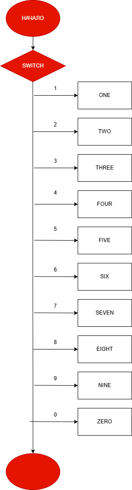

# Домашняя работа к лабораторной работе 7.
## Условия задачи:
Составить программу, которая для каждой введенной цифры (0-9) вывести соответствующее ей название на английском языке (0 – zero, 1 – one, 2 – two ...)
## 1. Алгоритм и блок схема:
### Алгоритм:
1. Начало
2. Задать переменнные:
  - char c
3. Создание ветвлений:
  - 1 = one
  - 2 = two
  - 3 = three
  - 4 = four
  - 5 = five
  - 6 = six
  - 7 = seven
  - 8 = eight
  - 9 = nine
  - 0 = zero
4. Вывести результаты расчётов с подстановкой значений в текст.
5. Конец

### Блок схема

## 2. Реализация программы:
    #define _CRT_SECURE_NO_DEPRECATE
    #include <locale.h>
    #include <stdio.h>
    
    int main()
    
    {
    	setlocale(LC_ALL, "RUS");
    	char c;
    	printf("Введите число: ");
    	scanf("%c", &c);
    	switch (c)
    	{
    	case '1':
    		printf("one");
    		break;
    	case '2':
    		printf("two");
    		break;
    	case '3':
    		printf("three");
    		break;
    	case '4':
    		printf("four");
    		break;
    	case '5':
    		printf("five");
    		break;
    	case '6':
    		printf("six");
    		break;
    	case '7':
    		printf("seven");
    		break;
    	case '8':
    		printf("eight");
    		break;
    	case '9':
    		printf("nine");
    		break;
    	case '0':
    		printf("zero");
    		break;
    	}
    	return 0;
    }
## 3. Результат работы программы

## 4. Информация о разработчике
Лаврова Мария, бИПТ-252# Lab7
